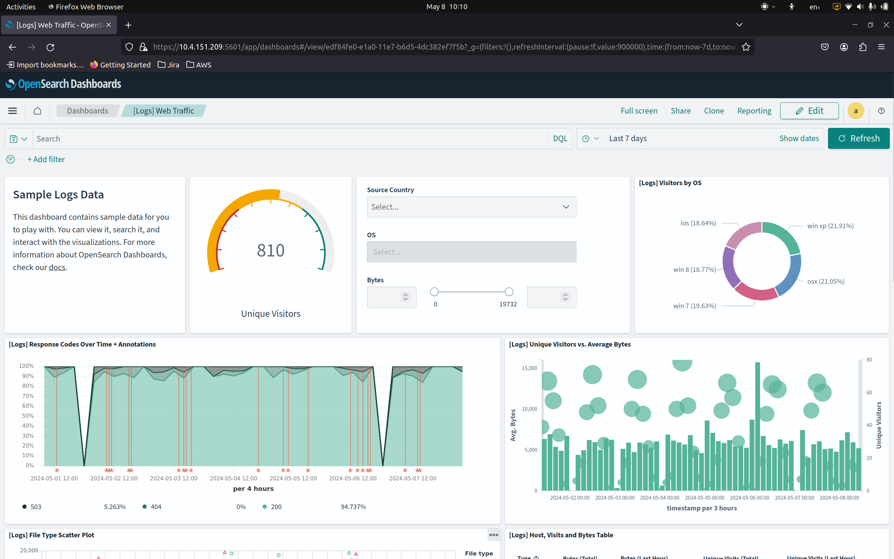
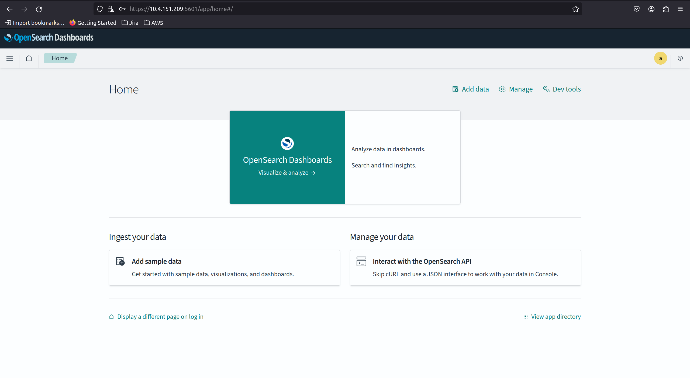

# OpenSearch Dasboards Operator
[](https://charmhub.io/opensearch)
[](https://github.com/canonical/opensearch-dashboards-operator/actions/workflows/release.yaml)
[](https://github.com/canonical/opensearch-dashboards-operator/actions/workflows/ci.yaml)
[](https://github.com/canonical/opensearch-dashboards-operator/actions/workflows/sync_docs.yaml)


[//]: # (<h1 align="center">)
[//]: # (  <a href="https://opensearch.org/">)
[//]: # (    )
[//]: # (  </a>)
[//]: # (  <br />)
[//]: # (</h1>)

# Description


[Opensearch Dashboards](https://opensearch.org/docs/latest/dashboards/) 
is a frontend application that lets you visualize data stored in an Opensearch
database. Charmed Opensearch Dashboard is the adaptation of the 
[Opensearch Dashboards](https://opensearch.org/docs/latest/dashboards/) 
user interface to the [Juju](https://juju.is/) environment.

The charm supports access via:

 - HTTPS (typically for direct access)
 - HTTP (load-balancing) 



# Usage

## Pre-requisites

### Juju

Opensearch Dashboard is a Juju charm. This means that an existing Juju environment is necessary.

Install and initialize the [LXD](https://canonical.com/lxd) 
lightweight container hypervisor and Juju from the [Snap Store](https://snapcraft.io/store):

```
sudo snap install juju --classic --channel=3.1/stable
sudo snap install lxd
lxd init --auto
```
Then boostrap Juju over LXD:
```
juju bootstrap localhost
```


### Opensearch

Opensearch Dashboards visualizes an underlying OpenSearch database.
This means that a [Charmed Opensearch](https://charmhub.io/opensearch/)
instance also has to be ready and available.

A straightforward installation guide is available in the charm's 
[Github repository](https://github.com/canonical/opensearch-operator?tab=readme-ov-file#usage):


## Opensearch Dashboards charm installation

The Dashboards charm requires no specific environment adjustments.
Therefore all we need to do to deploy the charm from [Charmhub](https://charmhub.io/opensearch-dashboards)

```
juju deploy openserach-dashboards --channel=2/edge
```
and relate it to the Opensearch charm:
```
juju relate opensearch opensearch-dashboards-operator
```

### TLS encryption

Switching to TLS support for the Opensearch Dashboards charms goes identical to
how it goes for Opensearch.

Install the 
[self-signed-certificats Operator](https://github.com/canonical/self-signed-certificates-operator)

```
juju deploy self-signed-certificates --channel=latest/stable
```
and relate it to the Dashboards charm

```
juju relate opensearch-dashboards self-sigend-certificates
```

## Testing interactive access

Functionality of the service can be tested by making an attempt to access the
portal either from the command-line or a web browser.

A few pieces of information are required to do this.

### URL

Construct the URL first.

The Dashboard front-end is exposed on port `5601`. Using `juju status` we can
retrieve the IP of each unit:

```
opensearch-dashboards/0*     active    idle   1        10.4.151.209              
```

Using the example, the Dashboard URL is `http://10.4.151.209:5601`.


### Authentication

Set up a user using the `data-integrator` [charm](https://charmhub.io/data-integrator)
that has to be related to `opensearch` to create a new database user.

```
$ juju deploy data-integrator
$ juju deploy data-integrator --config index-name=<index_name>
```

Retrieve user credentials running

```
juju run data-integrator/0 get-credentials
```
at the bottom of the output you should see something like:

```
  password: 8kubD7nbWYZFHPVEzIVmTyqV42I7wHb4
  <CA certificate here>
  username: opensearch-client_15
```

## Accessing the Dashboard

Using information from above, the dasboard URI consists is construted as `https://<IP>:5601

You should log in with the credentials of the new user.



You must create an "intex pattern" that enables the Dasboard to access the user's data.
It should specify `index_name` that was used to create the user with `data-integrator`

Follow instructions from Opensearch documentation on 
[How to create an index pattern](https://opensearch.org/docs/latest/dashboards/management/index-patterns/#creating-an-index-pattern)

When the index pattern is defined, data that belongs to the user will dispaly in the Dasboards.


# License

The Charmed Opensearch Dashboards Operator is free software, distributed under the Apache
Software License, version 2.0. See [LICENSE](./LICENSE) for more information.

