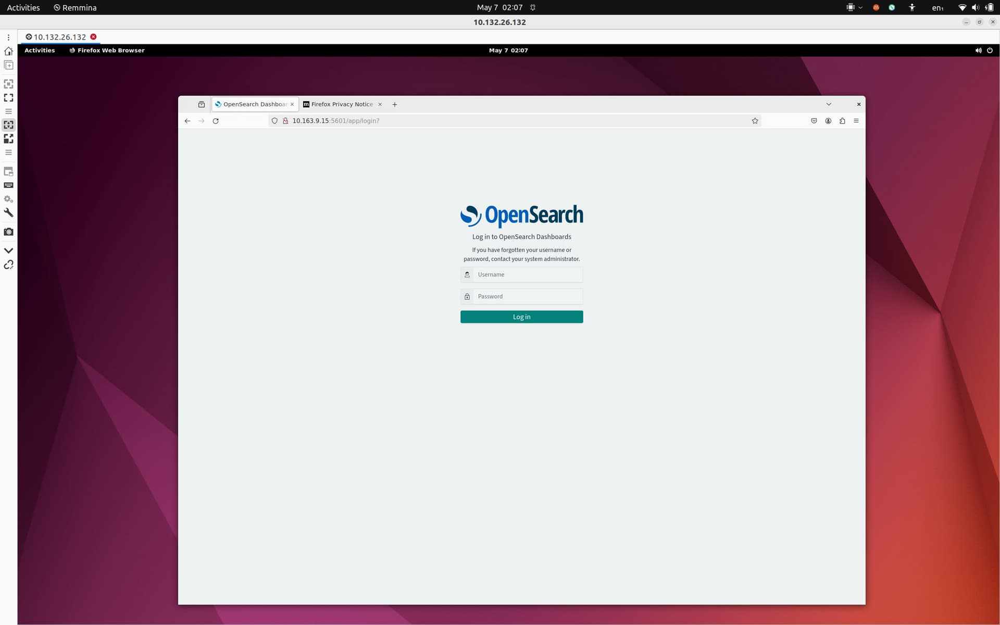
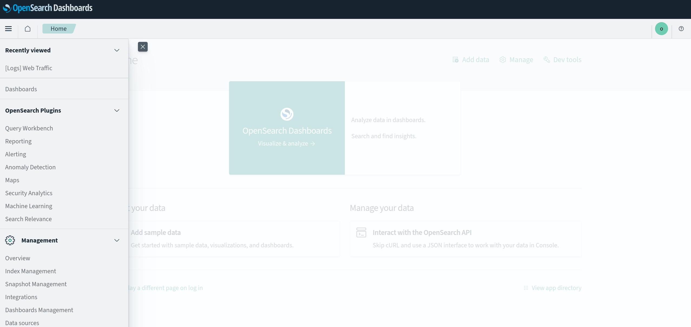
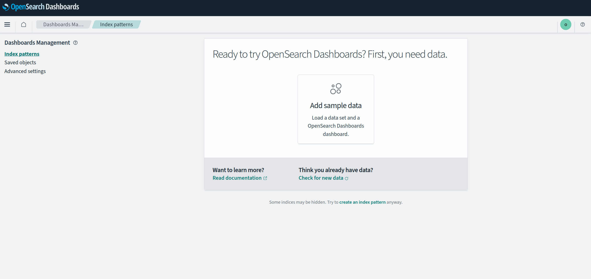
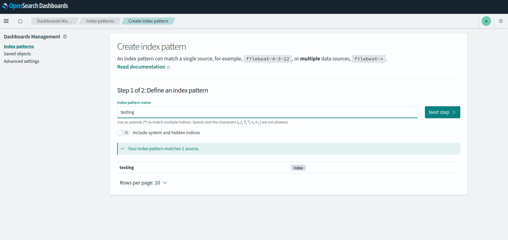
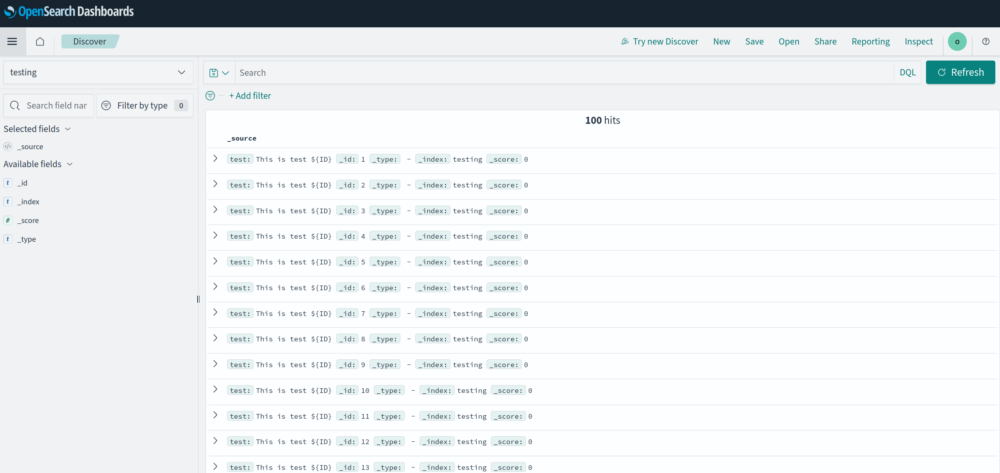
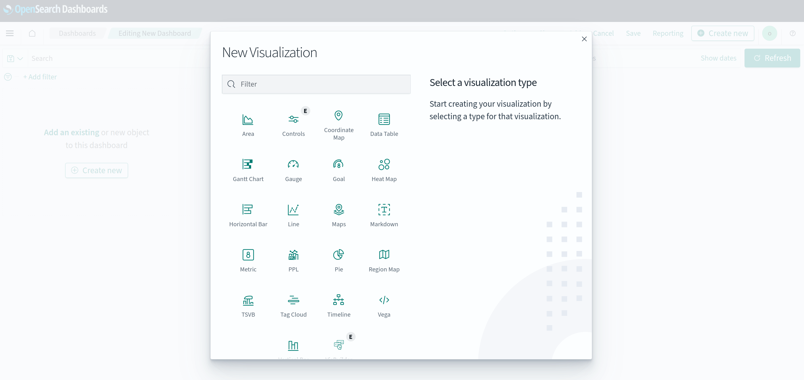

(tutorial-4-interactive-access)=
# 4. Access Opensearch Dashboards

Assuming that you have a virtual environment available
(as described in Step 1.[Set up a virtual environment](tutorial-1-set-up-the-environment)),
open a browser and type there the following URL:

```text
http://<dashboards_juju_public_address>:5601
```

The address of the unit is available in the `juju status` output of the opensearch-dashboards unit.
For example, in the output from Step 2. [Deploy](tutorial-2-deploy), this would be `10.163.9.173`.

You should see something like this:



## Set up an Opensearch user

Set up a user using the `data-integrator` [charm](https://charmhub.io/data-integrator).

At deployment time the Opensearch index (in the example: `index_name`) has to be specified as well. This is an arbitrary, alphanumerical identifier of the users' data space in Opensearch.

User creation takes affect when integrated against the  `opensearch` charm.

```bash
juju deploy data-integrator --config index-name=<intex_name>
juju integrate data-integrator opensearch
```

```{note}
This user will have normal privileges -- meaning this user will only have access
to the index it owns. 
```

In case a broader access to the cluster's indices is needed,
it is possible to create an admin / privileged user as follows:

```bash
juju deploy data-integrator admin --config index-name=admin-index --config extra-user-roles="admin"
```

```{caution}
Please only create admin users when extremely needed, and handle with special care
as authenticating with an admin user grants full access to all indices in the cluster.
```

Retrieve user credentials running

```bash
juju run data-integrator/0 get-credentials
```

at the bottom of the output you should see something like:

```bash
password: 8kubD7nbWYZFHPVEzIVmTyqV42I7wHb4
<CA certificate here>
username: opensearch-client_15
```

## Create the "index pattern"

Log in to the Dashboard using these credentials.
Clicking the top left icon the main menu will pull down.
Select **Management** / **Dashboards Management** here



Select **Index patterns** on the next view:



Click on **create index pattern** at the bottom.

Adding the index name that used for `data-integrator` deployment (in our example: `testing`) as an index pattern enables Dashboard access to the user's Opensearch space.



Click on the **Next step** button, and finalize the index pattern creation.

As a verification, the user's index metadata will display.

## Add and visualize data

For test purposes, a simple method could do. Like generating data from the command-line, via the Opensearch API:

```text
for ID in `seq 1 100`
do 
    curl -sk -u opensearch-client_15:8kubD7nbWYZFHPVEzIVmTyqV42I7wHb4 \
    -XPUT https://10.4.151.211:9200/testing/_doc/${ID} \
    -H "Content-Type: application/json" \
    -d '{"test": "This is test ${ID}"}'
done
```

This is how raw data gets displayed in the Dashboard



## Data Visualization

Opensearch Dashboards offers a variety of diagrams and data displays.

Choose **Dashboards** in the main left-side menu, and you will be presented to the selection:


